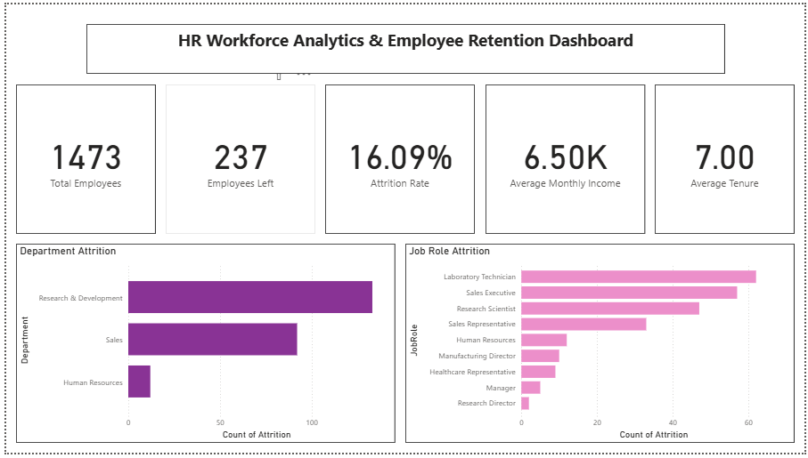
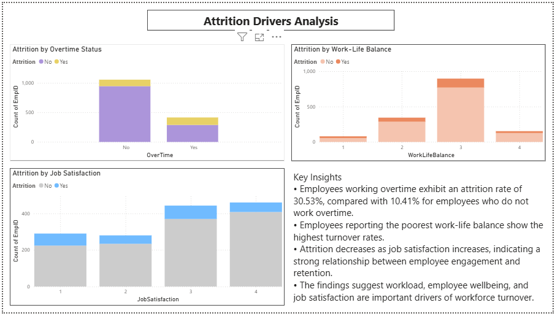
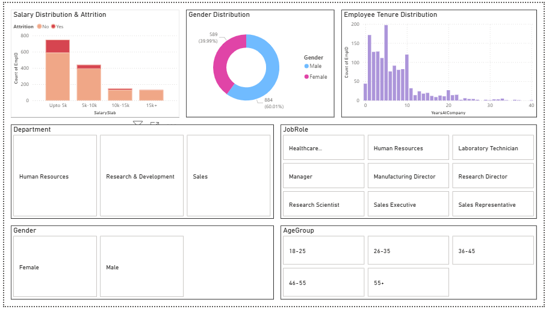

# 📊 HR Workforce Analytics & Employee Retention Dashboard

## 🚀 Project Overview

This project analyzes employee workforce data to identify the key drivers of employee attrition and provide actionable business recommendations to improve employee retention.

The project combines Python for data cleaning and exploratory data analysis (EDA) with Power BI for interactive dashboard development and business reporting.

---

## 🎯 Business Objective

The objective of this project is to answer key workforce questions:

* What is the overall employee attrition rate?
* Which departments and job roles experience the highest turnover?
* How do salary, overtime, job satisfaction, and work-life balance influence attrition?
* Which employee groups are most at risk of leaving?

---

## 🛠️ Tools & Technologies

| Category              | Tools               |
| --------------------- | ------------------- |
| Programming           | Python              |
| Data Analysis         | Pandas, NumPy       |
| Data Visualization    | Matplotlib, Seaborn |
| Business Intelligence | Power BI            |
| Version Control       | GitHub              |

---

## 📂 Project Structure

```text
HR-Workforce-Analytics-Employee-Retention/
│
├── HR_Workforce_Analytics_Employee_Retention.ipynb
├── HR_Analytics_Cleaned.csv
├── HR_Workforce_Analytics_Dashboard.pbix
├── executive_summary.png
├── attrition_drivers.png
├── workforce_profile.png
└── README.md
```

---

# 📈 Dashboard Pages

## 1️⃣ Executive Summary

Provides a high-level overview of workforce KPIs and attrition trends.

### Key Metrics

* Total Employees
* Employees Left
* Attrition Rate
* Average Monthly Income
* Average Employee Tenure

### Dashboard Preview



---

## 2️⃣ Attrition Drivers Analysis

Investigates the primary factors influencing employee turnover.

### Key Findings

* Employees working overtime exhibited nearly 3x higher attrition than employees who did not work overtime.
* Poor work-life balance was associated with increased turnover.
* Higher job satisfaction correlated with stronger employee retention.
* Employee wellbeing emerged as a major factor influencing workforce retention.

### Dashboard Preview



---

## 3️⃣ Workforce Profile

Explores workforce demographics and retention patterns.

### Areas Covered

* Salary Distribution
* Gender Distribution
* Employee Tenure
* Department Analysis
* Job Role Analysis
* Age Group Analysis

### Dashboard Preview



---

# 🔍 Exploratory Data Analysis Highlights

### Attrition by Department

Research & Development and Sales departments accounted for the highest number of employee exits.

### Attrition by Job Role

Sales Representatives and Laboratory Technicians experienced the highest turnover levels.

### Overtime Impact

Employees working overtime demonstrated significantly higher attrition rates than employees without overtime commitments.

### Work-Life Balance

Employees reporting poor work-life balance showed the highest likelihood of leaving the organization.

### Salary Impact

Lower salary bands exhibited noticeably higher attrition than higher-paid employee groups.

---

# 💡 Business Recommendations

* Reduce excessive overtime through workforce planning and resource allocation.
* Improve employee wellbeing and work-life balance initiatives.
* Review compensation structures for lower salary bands.
* Strengthen retention strategies for high-risk job roles.
* Enhance employee engagement programs to improve job satisfaction.

---

# 📊 Results

| Metric                   | Value   |
| ------------------------ | ------- |
| Total Employees Analyzed | 1,473   |
| Employees Left           | 237     |
| Attrition Rate           | 16.09%  |
| Average Monthly Income   | 6.5K    |
| Average Employee Tenure  | 7 Years |

### Key Attrition Drivers

* Overtime
* Work-Life Balance
* Job Satisfaction
* Salary Level

---

# 👤 Author

**Pavani Maganti**

MSc Artificial Intelligence

### Areas of Interest

* Data Analytics
* Machine Learning
* Business Intelligence
* Applied AI
* Data Visualization

---

⭐ If you found this project interesting, feel free to explore the notebook, dashboard, and analysis included in this repository.
